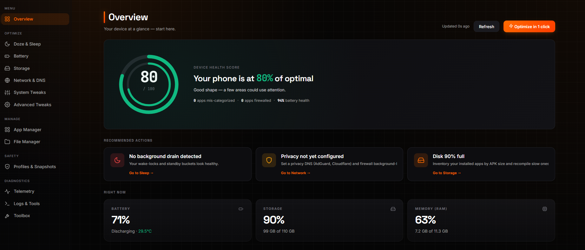
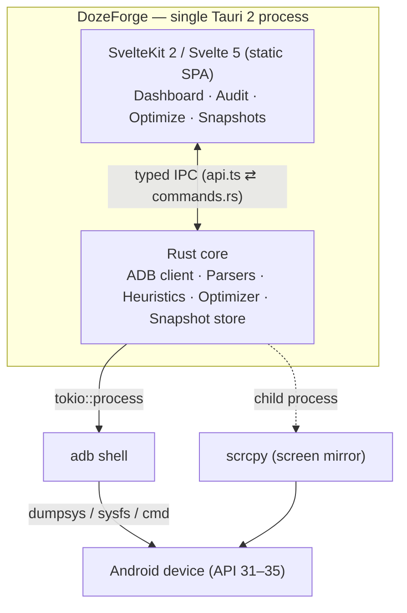

<div align="center">

# DozeForge

**Forge your own power-management rules for Android. A surgical ADB battery & CPU auditor with atomic rollback and zero root.**

[](https://tauri.app)
[](https://www.rust-lang.org)
[](https://kit.svelte.dev)
[](https://svelte.dev)
[](https://www.typescriptlang.org)
[-3DDC84?logo=android&logoColor=white)](https://www.android.com)
[](https://github.com/Genymobile/scrcpy)
[](LICENSE)




</div>

---

> [!WARNING]
> **Use at your own risk.** DozeForge's core optimizer is no-root and reversible, but the app also ships **advanced power tools** — Recovery (reboot to bootloader, `fastboot flash`, A/B slot switch, OTA sideload) and an optional **Root** tab (CPU governor, I/O scheduler, `setenforce`, cache drop). A wrong or interrupted flash, or misuse of these, can **soft-brick or hard-brick your device, void your warranty, or trip Play Integrity / banking apps**. These features are opt-in and gated behind an unlocked bootloader or granted root. The authors accept **no liability** for any damage. Always have the correct stock firmware for your *exact* model + build before flashing.

## What is DozeForge

DozeForge is a cross-platform desktop app (Windows, macOS and Linux; built with Tauri 2) that audits and fixes Android battery drain **over ADB, without root**. Instead of guessing "bad apps" from a blocklist, it reads the device's real telemetry, traces the *actual* culprit behind the symptom, applies progressive restrictions using only public Android primitives, and snapshots every change so you can **roll back atomically** — or export the whole plan as a Termux/Shizuku shell script that survives without the PC.

Modern Android leaks battery because of:

1. **OEM bloatware** that survives every reboot and ignores Doze (Samsung Health, MIUI Cleaner, Xiaomi GetApps…).
2. **Third-party apps proxying through Google Play Services** (FCM, JobScheduler), so the symptom shows up as `com.google.android.gms` while the real culprit stays hidden.
3. **The phantom-process killer (API 31+)** that nukes legitimate background tools (Termux, Tasker) while OEM services keep running fine.

DozeForge is built to see through all three.

> **Zero root, public primitives only.** Every change uses `cmd appops`, `am set-standby-bucket`, or `pm disable-user` — all reversible. Nothing under `/system`, `/vendor`, or `/apex` is ever touched, and no package with `uid < 10000` is modified.

## Features

| Area | Route | What it does |
|------|-------|--------------|
| **Overview** | `/` | Snapshot of the selected device: health, sleep score, top offenders |
| **Fleet** | `/fleet/` | Bulk actions across many attached devices at once |
| **Doze & Sleep** | `/sleep/` | Wakelock analysis, sleep timeline, culprit ranking |
| **Battery** | `/battery/` | Health, cycles, sysfs, per-app drain, historical charts |
| **Storage** | `/storage/` | Inventory by code size, cache trim, background dexopt |
| **Network & DNS** | `/network/` | Private DNS presets, data saver, per-app firewall |
| **System Tweaks** | `/system/` | Global system settings (refresh rate, audio, captive portal) |
| **Advanced Tweaks** | `/tweaks/` | RAM Plus, phantom-process limit, power-user toggles |
| **App Manager** | `/apps/` | Bloatware, firewall, permissions audit, per-app details |
| **File Manager** | `/files/` | Browse device storage over ADB |
| **Backup & Restore** | `/backup/` | Encrypted `.ab` backups |
| **Profiles & Snapshots** | `/safety/` | 1-click optimize with atomic undo |
| **Telemetry** | `/telemetry/` | Live process table |
| **Logs & Tools** | `/tools/` | Live logcat/dmesg, bugreport capture, automation export |
| **Toolbox** | `/toolbox/` | Utilities, including **Screen Mirror** (scrcpy) |

Extras: a global command palette (`Ctrl/Cmd + K`), light/dark themes, full **English / Spanish** localization, and a frameless custom-chrome window.

## Architecture



The frontend is pure presentation and does **no** network I/O — even manifest updates flow through the native side. The only external binary is scrcpy, spawned as a child process for screen mirroring (never on the IPC path). See [`docs/ARCHITECTURE.md`](docs/ARCHITECTURE.md) for the full design rationale.

## Tech stack

**Frontend** — SvelteKit 2, Svelte 5 (runes), TypeScript, Fuse.js (command palette), `@tanstack/svelte-virtual`, custom CSS design system (accent `#FF6B00`).
**Native** — Tauri 2, Rust 1.79+, `tokio` (async ADB), `tracing` (logging), `serde`, `sha2` (snapshot hashing).
**Tooling** — Vite 6, Vitest, `svelte-check`, GitHub Actions (Rust + frontend + Android emulator matrix).
**Bundled** — [scrcpy](https://github.com/Genymobile/scrcpy) for the Screen Mirror feature (fetched, not versioned — see below).

<details>
<summary>Backend modules (<code>src-tauri/src/</code>)</summary>

| Module | Responsibility |
|--------|----------------|
| `adb` | Async ADB client, device discovery, **multi-device support** (`-s <serial>`), capability probing |
| `parsers` | **Version-aware** dumpsys/sysfs parsers (batterystats, cpuinfo, alarm, jobscheduler, deviceidle, kernel wakelocks, process status, storage, DNS, …) with fixtures per API level |
| `heuristics` | Risk classification, **GMS proxy detection** via `dumpsys alarm`, continuous CPU sampling (p50/p95), bloatware recommendations |
| `optimizer` | Standby buckets, AppOps revocation, selective `am kill`, `pm disable-user --user 0`, profiles |
| `snapshot` | **True differential snapshots** with content-addressed storage, fingerprint-tolerant rollback |
| `export` | Shell-script generator with SHA-256 checksum, MacroDroid task templates |
| `ipc` | Tauri command handlers + streaming (the only Rust surface exposed to the UI) |
| `security` | Package/UID guardrails enforced before any destructive action |
| `telemetry` | Structured logging via `tracing` + rotating file appender |

</details>

## Getting started

### Prerequisites

- **Node 22+**
- **Rust** toolchain (stable) — `winget install Rustlang.Rustup && rustup default stable`
- **Tauri 2 CLI** — `cargo install tauri-cli --version "^2.0"`
- **ADB** platform-tools on your `PATH` (on Windows a copy also ships with the bundled scrcpy)
  - **macOS:** `brew install android-platform-tools scrcpy`
  - **Linux:** `sudo apt install adb fastboot scrcpy` (or your distro's equivalent)
  - **Windows:** `winget install Google.PlatformTools` (scrcpy is fetched automatically on `npm install`)

### Install & run (dev)

```powershell
git clone https://github.com/IvanjonasFC/Dozeforge.git
cd Dozeforge
npm install          # also fetches scrcpy via postinstall (see Screen Mirror)
npm run tauri:dev
```

### Build a release bundle

```bash
npm run tauri:build
```

This produces a native installer for the host OS: **NSIS `.exe`** (Windows), **`.dmg`/`.app`** (macOS), and **`.deb`/`.AppImage`** (Linux). CI builds all three on every tagged release.

> [!NOTE]
> Release binaries are **not code-signed yet**. On Windows, SmartScreen shows *"Windows protected your PC / unknown publisher"* — click **More info → Run anyway**. On macOS, Gatekeeper may need **right-click → Open** (or `xattr -dr com.apple.quarantine DozeForge.app`). This is expected for an unsigned open-source build; verify the checksums published on the Releases page.

App icons live in `src-tauri/icons/` (already committed); see `src-tauri/icons/README.md` to regenerate them from a single PNG.

<details>
<summary>Screen Mirror (scrcpy) — how the binaries are handled</summary>

The **Screen Mirror** feature bundles [scrcpy](https://github.com/Genymobile/scrcpy). Its ~40 MB of Windows binaries are **not** committed to git; they are fetched automatically on `npm install` (via `postinstall`), so a fresh clone works out of the box.

```powershell
npm run setup:scrcpy             # download if missing
npm run setup:scrcpy -- --force  # re-download / upgrade
$env:SCRCPY_VERSION = "v3.3.4"; npm run setup:scrcpy   # pin a version
```

At runtime, `resolve_scrcpy()` prefers the bundled copy, then a `scrcpy/` folder next to the executable, then the system `PATH`, then common install locations. Full details (and the manual/offline procedure) in [`src-tauri/scrcpy/README.md`](src-tauri/scrcpy/README.md).

</details>

## Safety model

The **core optimizer** (Overview, Battery, Doze & Sleep, Advanced Tweaks, App Manager, Backup) **never**:

- Runs as root or asks for root.
- Touches packages with `uid < 10000`.
- Touches anything under `/system`, `/vendor`, or `/apex`.
- Applies a destructive command without first snapshotting the affected appops/buckets.
- Restores a snapshot when `sdk_int` differs from the snapshot's `sdk_int` (a change in `security_patch_month` within the same SDK is allowed).

> [!IMPORTANT]
> The **Recovery** page and the optional **Root** tab are separate, advanced tools that deliberately step outside the guarantees above — `fastboot flash`, A/B slot switching, OTA sideload, `setenforce`, and kernel sysfs writes. They are **opt-in**, gated behind an unlocked bootloader or granted root, and clearly labelled with a `root` tag. Use them only if you understand the consequences (see the disclaimer at the top of this README).

<details>
<summary>Project structure</summary>

```text
dozeforge/
├─ README.md · LICENSE (MIT) · docs/ARCHITECTURE.md
├─ assets/portada.png                (cover art)
├─ package.json + svelte/vite/ts configs
├─ scripts/setup-scrcpy.mjs          (fetches the scrcpy Windows build)
├─ src/                              (SvelteKit frontend)
│  ├─ routes/                        (Overview, Fleet, Sleep, Battery, Storage, Network,
│  │                                  System, Tweaks, Apps, Files, Backup, Safety,
│  │                                  Telemetry, Tools, Toolbox)
│  ├─ lib/
│  │  ├─ components/                 (DevicePicker, PairingModal, CommandPalette,
│  │  │                               AppDetailsModal, AppName, BatteryHistory,
│  │  │                               DebloatWizard, CapabilitiesBanner, RiskBadge,
│  │  │                               StatCard, Skeleton)
│  │  ├─ stores/                     (device, cache, i18n, labels, snapshots, theme,
│  │  │                               appModal — Svelte 5 runes singletons)
│  │  ├─ parsers/                    (appInspector, batteryHistory, trackerScan)
│  │  ├─ data/trackers.ts            (known tracker signatures)
│  │  ├─ tauri/api.ts                (typed wrapper over invoke())
│  │  ├─ types.ts                    (mirror of Rust serialised types)
│  │  └─ utils/format.ts
│  └─ styles/global.css
├─ src-tauri/                        (Rust backend)
│  ├─ Cargo.toml · tauri.conf.json
│  ├─ capabilities/                  (granular Tauri 2 capabilities)
│  ├─ icons/                         (app icons, committed)
│  ├─ scrcpy/                        (README only; binaries fetched, git-ignored)
│  ├─ resources/ · manifests/        (seed manifests, UAD lists)
│  └─ src/
│     ├─ main.rs + lib.rs            (registers the Tauri command surface)
│     ├─ adb/ · parsers/ · heuristics/ · optimizer/
│     ├─ snapshot/ · export/ · ipc/ · security/ · telemetry/
│     └─ state.rs + error.rs
├─ tests/fixtures/                   (batterystats / alarm / jobscheduler for API 34)
└─ .github/workflows/ci.yml          (Rust + frontend + Android emulator matrix)
```

</details>

## Roadmap

- [x] macOS / Linux desktop builds (CI matrix — beta)
- [ ] Signed, auto-updating manifest of known offenders
- [ ] Scheduled/automated audits per device
- [ ] Expanded fleet actions and profiles
- [ ] In-app scrcpy recording & snapshots

## License

Distributed under the [MIT](LICENSE) license. Bundled third-party components are
listed in [NOTICE](NOTICE). DozeForge ships its own MIT-licensed bloatware seed;
the GPL-3.0 UAD-NG community list is **not** bundled — users can optionally fetch
it at runtime with `scripts/sync-uad-list.mjs`. See NOTICE for details.
